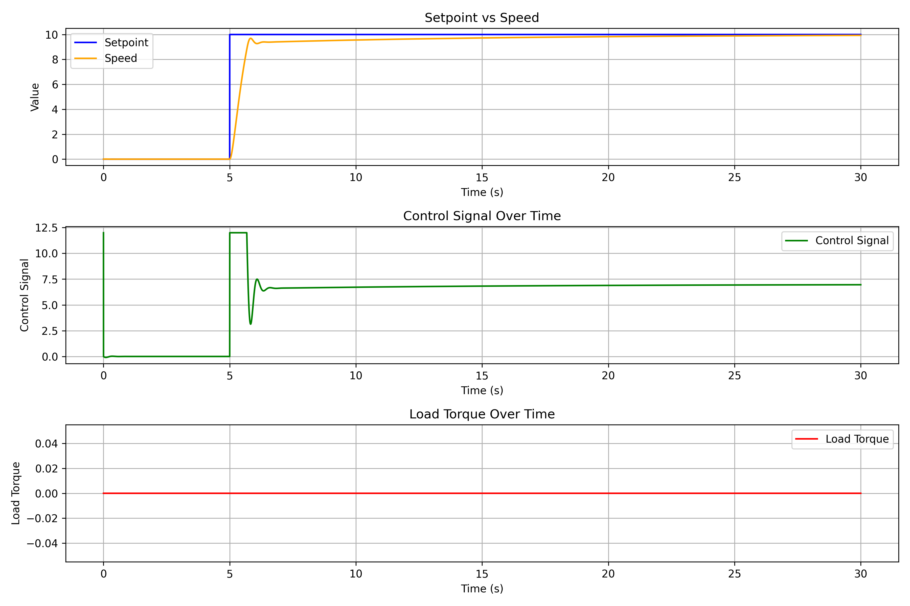
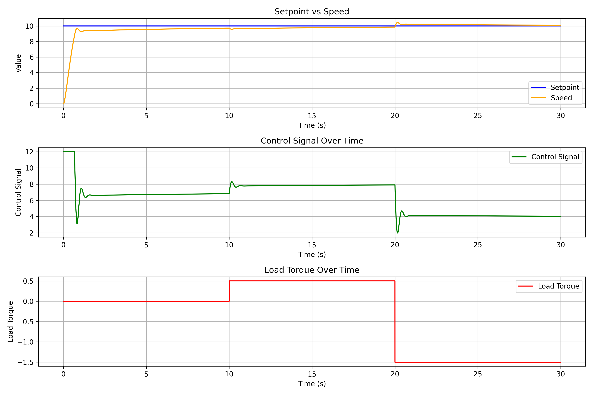

# PID Control of a DC Motor

This is a small C++ project for simulating PID speed control of a DC motor.

The program runs a few test scenarios, saves the results to CSV files, and the Python script can turn them into plots.

## What is in the project

- `PID` controller with output limits
- DC motor model
- simulation loop
- a few ready scenarios:
  - step response
  - setpoint changes
  - heavy load
  - saturation
  - disturbance
- Python script for plotting saved data

## Project structure

- `include/` - headers
- `src/` - C++ source files
- `src/scenarios/` - simulation scenarios
- `data/` - generated CSV files and plots
- `scripts/data_visualization.py` - plotting script

## Build

```bash
mkdir -p build
cd build
cmake ..
cmake --build .
```

## Run

From the project root:

```bash
./build/pid_app
```

This will run all scenarios and save CSV files in `data/`.

## Plot results

Install Python packages if needed:

```bash
pip install -r requirements.txt
```

Then run:

```bash
python scripts/data_visualization.py
```

This will read the CSV files from `data/` and save plots as PNG files in the same folder.

## Example plots

### Step response

This plot shows the basic response of the controller to a constant target speed.  
You can see how fast the motor reaches the setpoint and how smooth the control signal is.



### Disturbance response

This plot shows what happens when extra load torque is added during the simulation.  
It is useful for checking if the controller can recover after a disturbance.



## Example output files

- `data/scenario_step.csv`
- `data/scenario_setpoint_changes.csv`
- `data/scenario_heavy_load.csv`
- `data/scenario_saturation.csv`
- `data/scenario_disturbance.csv`

## Notes

- The simulation uses a discrete time step.
- Motor voltage is limited to match actuator saturation.
- Disturbances and setpoint changes can be added in chosen scenarios.

## Why I made it

This project was made to practice:

- object-oriented C++
- basic control theory
- PID tuning and simulation
- saving and visualizing results
